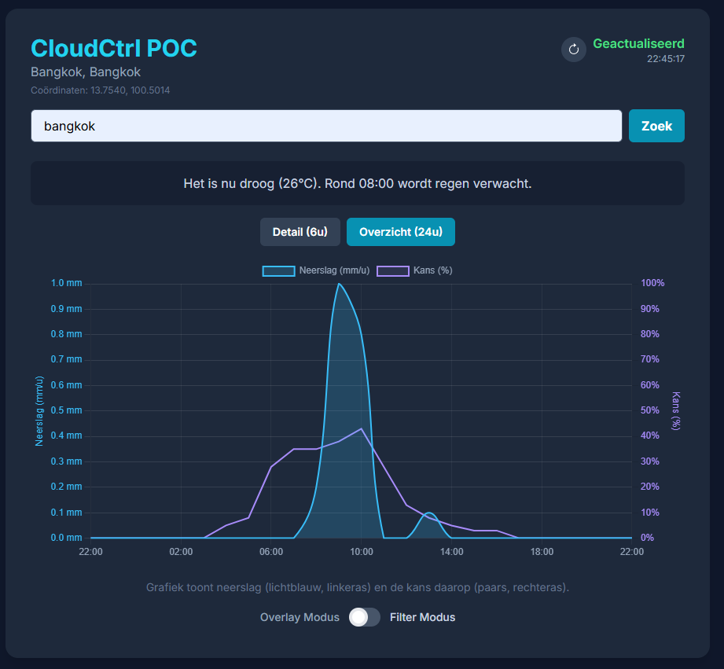

# CloudCtrl

CloudCtrl is a Proof of Concept (POC) web app that visualizes precipitation forecasts from the Open-Meteo API. Its unique feature is the ability to filter the forecast based on a **double threshold**: both the minimum amount of precipitation and the minimum probability of rain.

The interface has evolved to provide a clearer and more intuitive representation of the weather data.

| Initial Version | Evolved Version |
| :---: | :---: |
|  |  |

## Table of Contents

- [Concept](#concept)
- [Features](#features)
- [Tech Stack](#tech-stack)
- [How to Use](#how-to-use)
- [Build-Me Tutorial](#build-me-tutorial)
- [Changelog](#changelog)
- [License](#license)

## Concept

Traditional weather apps often show all predicted precipitation, which can lead to alerts for drizzle you'd barely notice. CloudCtrl aims to make forecasts more useful by letting the user define what "rain" actually means to them.

By adjusting sliders for both **amount (mm/h)** and **probability (%)**, you effectively take control of your cloud forecast, ensuring you only get alerted for weather you care about.

## Features

* **Automatic Geolocation:** Fetches the user's location on load for an instant local forecast.
* **Manual Search:** Look up any city or address to get a forecast for that specific location.
* **Interactive Chart:** A clean chart (using Chart.js) that visualizes the filtered precipitation forecast with dynamic color intensity based on probability.
* **Dynamic Summary:** A human-readable summary that explains if and when rain is expected based on your custom thresholds.
* **Double Threshold Filtering:** Use sliders to adjust the minimum amount (mm/h) and probability (%) of rain to dynamically filter the chart and summary.
* **Filter & Overlay Modes:** Switch between "Filter Mode" to see only the rain that meets your criteria, and "Overlay Mode" to compare potential vs. expected precipitation.
* **Detail & Overview Modes:** Switch between a 6-hour detailed view (per 15 min) and a 24-hour overview (per hour).
* **Dark Mode Interface:** A sleek and modern interface built with Tailwind CSS.
* **Internationalization (i18n):** Supports both English and Dutch.

## Tech Stack

* **Frontend:** HTML5, Tailwind CSS, vanilla JavaScript (ES6+).
* **Visualization:** [Chart.js](https://www.chartjs.org/) with the [chartjs-plugin-zoom](https://www.chartjs.org/chartjs-plugin-zoom/latest/).
* **APIs:**
    * **Weather Data:** [Open-Meteo Forecast API](https://open-meteo.com/)
    * **Geocoding:** [Open-Meteo Geocoding API](https://open-meteo.com/en/docs/geocoding-api) & [Nominatim (OpenStreetMap)](https://nominatim.org/)

## How to Use

As this is a self-contained webpage with no build process, you can use the project locally by simply opening the `index.html` file in any modern web browser. For online deployment, a static hosting service like GitHub Pages, Netlify, or Vercel can be used.

## Build-Me Tutorial

This project includes a `BUILDME.md` file that provides a step-by-step guide on how to construct the entire application from scratch using a series of prompts. This is a great way to understand the project's architecture and development process. Following the guide will result in the application shown below.

## Changelog

* **v1.0.0**
    * Added `BUILDME.md` guide and updated README with a comparison table.
    * Introduced Overlay Mode for comparing potential vs. expected precipitation.
    * Added Internationalization (i18n) for English and Dutch.
    * Refined chart visualization with intensity bands and improved tooltips.
* **Initial Release**
    * Implementation of all core features: location detection, chart visualization, and double threshold filtering.
    * User interface setup with Tailwind CSS.
    * Added Detail (6h) and Overview (24h) modes.

## License

This project is released under the MIT License. See the `LICENSE` file for more details.