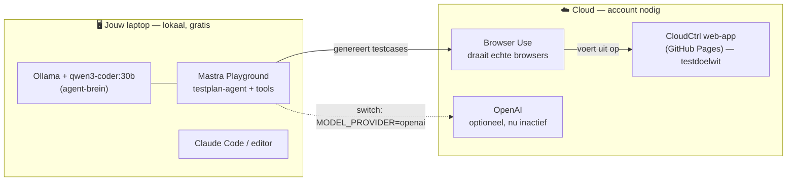

# CloudCtrl Agent Workshop — Werkboek

> Een hands-on werkboek om tijdens de Google-dag een **agentic AI-pipeline** te bouwen
> bovenop je eigen project: **CloudCtrl** (web). We gebruiken de dubbele-drempel-feature
> als rode draad — van testcases genereren tot ze automatisch laten uitvoeren in de browser.

---

## Inhoud

- [0. Intro — wat & waarom](#0-intro--wat--waarom)
- [0.1 Wat draait waar — lokaal vs. cloud](#01-wat-draait-waar--lokaal-vs-cloud)
- [1. Waar we mee eindigen](#1-waar-we-mee-eindigen)
- [2. Leermomenten (agents = nieuw terrein)](#2-leermomenten-agents--nieuw-terrein)
- [3. Voorbereiding & checklist](#3-voorbereiding--checklist)
- [4. De rode draad: de dubbele-drempel-feature](#4-de-rode-draad-de-dubbele-drempel-feature)
- [Stap 1 — CloudCtrl deployen (doelwit voor de browser-agent)](#stap-1--cloudctrl-deployen)
- [Stap 2 — Mastra-project opzetten + Playground](#stap-2--mastra-project-opzetten--playground)
- [Stap 3 — De bronnen klaarzetten (PR + scrumkaart)](#stap-3--de-bronnen-klaarzetten)
- [Stap 4 — Testplan-agent: custom tools](#stap-4--testplan-agent-custom-tools)
- [Stap 5 — Testplan-agent bouwen & testcases beoordelen](#stap-5--testplan-agent-bouwen--testcases-beoordelen)
- [Stap 6 — Browser-agent met Browser Use](#stap-6--browser-agent-met-browser-use)
- [Stap 7 — De pipeline koppelen](#stap-7--de-pipeline-koppelen)
- [Stap 8 — Rapportage](#stap-8--rapportage)
- [Stap 9 — Agentic quality-check skill](#stap-9--agentic-quality-check-skill)
- [Stap 10 — Portable testspec exporteren (de Kotlin-brug)](#stap-10--portable-testspec-exporteren)
- [Appendix A — CloudCtrl selector-kaart](#appendix-a--cloudctrl-selector-kaart)
- [Appendix B — Open-Meteo API-contract](#appendix-b--open-meteo-api-contract)
- [Appendix C — De portable testtabel](#appendix-c--de-portable-testtabel)
- [Appendix D — Troubleshooting](#appendix-d--troubleshooting)
- [Appendix E — Woordenlijst](#appendix-e--woordenlijst)
- [Appendix F — Lokaal draaien met qwen3-coder (Ollama) + de switch](#appendix-f--lokaal-draaien-met-qwen3-coder30b-ollama--de-switch)

---

## 0. Intro — wat & waarom

**Wat gaan we doen?**
Tijdens de workshop bouwen we een **agentic pipeline**: twee AI-agents die samenwerken.

1. Een **testplan-agent** die op basis van bronnen (een pull request + een scrumbord-kaart)
   zelf testcases bedenkt voor een feature.
2. Een **browser-agent** die die testcases zelfstandig uitvoert in een echte browser.

Beide draaien lokaal in de **Mastra.ai Playground**. Daarnaast maken we een **agent skill**:
een agentische kwaliteitscontrole die al tijdens het ontwikkelen meekijkt.

**Waarom op CloudCtrl (web)?**

- Het is **van jou** — je kent de feature, dus je ziet meteen of de agent zinnige dingen doet.
  Een leermoment met eigen code beklijft; een vreemd voorbeeldproject vergeet je.
- De web-versie draait in een **browser met een DOM**, en dát is het enige dat een browser-agent
  kan aansturen. (Zie [§2](#2-leermomenten-agents--nieuw-terrein) voor waarom dit niet op een
  native Kotlin/Android-app kan.)
- De **dubbele-drempel-feature** (filter op mm/u én kans %) is een 2×2-waarheidstabel en levert
  daardoor rijke grenswaarden op — precies waar een QA'er en een agent elkaar vinden.

**Eerlijk kader.** Agents zijn nog relatief nieuw terrein. Ze zijn niet-deterministisch, kunnen
hallucineren en hebben sturing nodig. Verwacht dat het de eerste keer niet in één keer perfect
loopt — dát is het leren. En zelfs als de web-code straks wegvalt (jij gaat verder in Kotlin),
blijft de opgedane kennis over **hoe je agents bouwt en stuurt** volledig overeind. De testcases
die je vandaag genereert zijn bovendien platform-neutraal en neem je zó mee naar je Kotlin-app
(zie [Stap 10](#stap-10--portable-testspec-exporteren)).

---

## 0.1 Wat draait waar — lokaal vs. cloud

Voordat je begint: het helpt enorm om te weten wat **op je eigen machine** draait en wat een
**cloud-dienst** vereist. Dat bepaalt wat gratis/offline kan en waar je een account nodig hebt.



| Onderdeel | Waar | Kan het lokaal? |
|---|---|---|
| Agent-brein (LLM) | Lokaal **of** cloud | ✅ Lokaal via Ollama/qwen — met switch naar cloud |
| Mastra Playground | Lokaal | ✅ altijd lokaal (`http://localhost:4111`) |
| Testplan-agent | Lokaal | ✅ draait op je eigen model |
| Coding assistant (Claude Code) | Lokaal | ✅ |
| **Browser Use** (browser-agent) | **Cloud** | ❌ cloud-dienst; kan je `localhost` niet zien |
| **CloudCtrl web-app** (testdoelwit) | **Cloud** (GitHub Pages) | ⚠️ draait ook lokaal, maar Browser Use Cloud bereikt localhost niet → deploy nodig |

**De kernregel:** alles wat *redeneert* (de agent) kan lokaal; alles wat een *echte browser in de
cloud* nodig heeft (Browser Use → CloudCtrl-URL) moet cloud zijn. Zie ook
[Appendix F](#appendix-f--lokaal-draaien-met-qwen3-coder30b-ollama--de-switch) voor de model-switch.

## 1. Waar we mee eindigen

Aan het eind van de dag heb je:

| # | Deliverable | Wat het is |
|---|---|---|
| 1 | **Testplan-agent** | Leest een PR + scrumkaart → genereert een lijst testcases voor de dubbele-drempel |
| 2 | **Browser-agent** | Voert een testcase zelfstandig uit op de live CloudCtrl-web-app en rapporteert pass/fail |
| 3 | **Pipeline** | Koppelt 1 → 2: gegenereerde cases worden automatisch uitgevoerd, met een eindrapport |
| 4 | **Quality-check skill** | Een agent skill die tijdens development je diff controleert |
| 5 | **Portable testspec** | Een Gherkin/tabel-spec die je later hergebruikt voor je Kotlin-app |

Deliverables 1–3 zijn de kern van de workshop. Deliverable 4 is de "agent skills"-uitsmijter.
Deliverable 5 is jouw eigen blijvende-waarde-verzekering.

---

## 2. Leermomenten (agents = nieuw terrein)

Houd deze concepten er expliciet bij — dit is de kennis die blijft, ongeacht welk framework of
welke taal je later gebruikt.

### 2.1 Wat is een agent (vs. een gewoon script)?
Een **script** volgt vaste, vooraf bepaalde stappen. Een **agent** krijgt een *doel* en beslist
zélf welke stappen (welke *tools*) hij inzet om dat doel te halen — in een lus van
*redeneren → tool aanroepen → resultaat bekijken → opnieuw*. De "intelligentie" zit in het LLM;
de "handen" zijn de tools die jij hem geeft.

### 2.2 Wat is een "tool"?
Een tool is een functie met een naam, een beschrijving en een invoer/uitvoer-schema. De agent
leest de beschrijving en beslist wanneer hij hem aanroept. **Custom tools** zijn tools die jíj
schrijft om de agent toegang te geven tot jouw wereld (een PR ophalen, een scrumbord lezen,
een browsertaak starten).

### 2.3 Waar agents sterk en zwak zijn
- **Sterk:** ongestructureerde input omzetten naar structuur (PR-tekst → testcases), variatie
  bedenken die een mens vergeet, natuurlijke taal begrijpen.
- **Zwak:** non-determinisme (twee runs = twee antwoorden), hallucinatie (verzint selectors of
  feiten), en **exacte assertions op live data**. → Zie 2.4.

### 2.4 Het belangrijkste QA-inzicht: test *invarianten*, geen vaste waarden
CloudCtrl gebruikt **live weerdata**. Morgen regent het misschien niet in Groningen. Laat de
browser-agent daarom niet asserten "er staan 3 balken", maar **relaties die altijd waar zijn**:

- *Monotonie:* een strengere drempel toont **nooit méér** regen dan een lossere drempel.
- *Ondergrens:* met beide drempels op 0 (in Filter Modus) wordt er **niets** weggefilterd.
- *Bovengrens:* met hoeveelheid op max (1.0) en kans op 100% blijft er hooguit extreme regen over.

Dit is dé les die je meeneemt naar élke agent die een UI met live data test.

### 2.5 Waarom dit web is en niet Kotlin/Android
Een browser-agent "ziet" een pagina via de **DOM / accessibility-tree** en stuurt elementen aan
via selectors (`#amountThresholdSlider`) of via screenshot + coördinaten. Een **native
Android-app heeft geen DOM** — die render je in een emulator en automatiseer je met een compleet
andere toolchain (Appium/UIAutomator/Espresso, of [Maestro](https://maestro.mobile.dev/)). De
browser-agent kan een Kotlin-app dus letterlijk niet aanraken. Wat je wél meeneemt is de
**testspec** (zie Stap 10): dezelfde cases, straks uitgevoerd door een mobiele executor.

### 2.6 De prompt is de specificatie
Je stuurt een agent niet met code maar met **instructies in natuurlijke taal**. Hoe scherper je
de rol, de grenzen en het gewenste uitvoerformaat beschrijft, hoe betrouwbaarder het resultaat.
Prompten is een vaardigheid — behandel de agent-instructies als productie-artefact, niet als
wegwerptekst.

### 2.7 Kosten-bewust ontwerp: goedkoop eerst, duur alleen bewust
Een agentische pijplijn mengt **gratis** stappen (lokale modellen) met **betaalde** (cloud-diensten
zoals Browser Use). Ontwerp 'm zo dat je **vrij kunt experimenteren zonder credits te verbranden**:

- Zet de goedkope, snelle stappen **vooraan** (genereren + reviewen op lokale modellen = gratis).
  Daar itereer je zoveel je wilt.
- Zet de dure stap (Browser Use = credits) **achteraan, achter een menselijke go/no-go**. Je "betaalt"
  pas als het gratis signaal (het rapport) zegt dat het de moeite waard is.
- Vuistregel: **fail cheap, verify expensive** — verbrand geen credits om iets te ontdekken dat een
  gratis stap ook had gevonden.

Dit is precies waarom de pijplijn (Stap 7) twee modi heeft: `npm run report` (gratis, t/m rapport)
en `npm run report:all` (1-click, inclusief Browser Use).

> ⚠️ **Dit is géén shift-left.** Shift-left = testen *tijdens de ontwikkeling* (bijvoorbeeld de
> agent-skill die je diff nakijkt terwijl je codeert — zie Stap 9). Deze pijplijn verifieert juist
> een feature die al klaar is. Het kosten-funnel-principe gaat over de *volgorde en kosten* van een
> verificatie-pijplijn, niet over *wanneer* in het ontwikkelproces je test. Twee verschillende
> assen — beide nuttig, maar niet hetzelfde.

---

## 3. Voorbereiding & checklist

Doe dit **de avond ervoor**, zodat je 's ochtends niet met setup worstelt.

```bash
node -v          # moet v20 of hoger zijn
git --version    # aanwezig?
```

- [ ] **Node.js ≥ 20** geïnstalleerd
- [ ] **Editor met AI** (VS Code / Cursor) of een AI-CLI (Claude Code / Codex / OpenCode)
- [ ] **GitHub-account** (heb je)
- [ ] **Hosting** voor CloudCtrl geregeld: GitHub Pages (geen account nodig) óf een Vercel-account
- [ ] **Browser Use-account** aangemaakt + API-key genoteerd
- [ ] **CloudCtrl staat live** (zie [Stap 1](#stap-1--cloudctrl-deployen)) — anders heeft de
      browser-agent geen doelwit
- [ ] API-keys klaar in een `.env` (nooit committen!)

> ℹ️ De workshop levert waarschijnlijk een **starter-repo** met exacte package-versies en
> misschien net andere API-namen dan hieronder. De **structuur en concepten** blijven identiek —
> gebruik de starter voor de precieze imports en pas de voorbeelden in dit werkboek daarop aan.

---

## 4. De rode draad: de dubbele-drempel-feature

Alles draait om deze feature uit CloudCtrl. Kort de werking (geverifieerd in
[`index.html`](index.html)):

- Twee sliders: **Min. hoeveelheid** (`amountThresholdSlider`, 0–1 mm/u, stap 0.05) en
  **Min. kans** (`probThresholdSlider`, 0–100 %, stap 5).
- Een datapunt "telt als regen" als het **aan beide** voorwaarden voldoet (hoeveelheid **én** kans).
- In **Filter Modus** wordt alles wat niet voldoet uit de grafiek gefilterd; in **Overlay Modus**
  zie je potentieel vs. verwacht.

**Let op — een echte inconsistentie in de code (bewust materiaal voor je testcases):**

- De **samenvatting** gebruikt strikt groter-dan: `p > amountThreshold && prob > probThreshold`
  ([`index.html:323`](index.html:323))
- De **grafiek** gebruikt groter-of-gelijk: `amount >= amountThreshold && prob >= probThreshold`
  ([`index.html:409`](index.html:409))

Op de grenswaarde (hoeveelheid *precies gelijk* aan de drempel) toont de grafiek dus wél een balk,
maar zegt de samenvatting "droog". Een goede testplan-agent hoort dit randgeval te bedenken. Dit
is je bewijs dat de hele exercitie waarde heeft — op jóuw feature.

---

## Stap 1 — CloudCtrl deployen

**Doel:** een publieke URL waar de browser-agent naartoe kan.

CloudCtrl is één self-contained `index.html` zonder build. Kies één optie:

**Optie A — GitHub Pages (aanbevolen, het simpelst).** GitHub serveert je statische site gratis,
direct vanaf je repo — geen extra account, geen build:

1. GitHub → repo `CloudCtrl` → **Settings → Pages**.
2. Bij "Build and deployment": Source **Deploy from a branch** → branch **`main`** → map `/ (root)` → **Save**.
3. Na ~1 min staat je site op **`https://dieboard.github.io/CloudCtrl/`**.

Pages serveert **altijd `main`**, dus geen branch-gedoe.

**Optie B — Vercel (alternatief, werkt net zo goed).** [vercel.com](https://vercel.com) → "Add New →
Project" → repo importeren → preset "Other" → Deploy. Vercel redeployt automatisch bij push naar de
ingestelde production-branch (Settings → Git → Production Branch). De CLI (`npx vercel`) is niet nodig.

**Optie C — lokaal serveren (om zelf even te klikken, niet als Browser Use-doelwit).**
```bash
npx serve .       # serveert index.html op http://localhost:3000
```
> ⚠️ Browser Use **Cloud** draait in de cloud en kan jouw `localhost` niet zien. Voor de browser-agent
> heb je dus Optie A of B nodig; Optie C is puur om zelf snel te testen.

### Hoe hosting en branches samenhangen (de vraag die vaak blijft hangen)

Dit stukje laat mensen makkelijk twijfelen — en in een workshop wil je het *begrijpen*, niet met een
open vraag blijven zitten. Kort en foolproof:

- Een statische host serveert **precies één branch** — wat daarop staat, is "live".
  - **GitHub Pages:** die branch stel je in bij Settings → Pages (standaard **`main`**).
  - **Vercel:** de "Production Branch" (standaard je repo-hoofdbranch, meestal `main`; aanpasbaar in
    Settings → Git). Dáárom leek het alsof je "geen branch kon kiezen" — hij pakt gewoon standaard je
    hoofdbranch.
- **Browser Use kijkt naar géén branch** — alleen naar de URL die jij geeft. Wat daar staat, test hij.

**Wat betekent dat in de praktijk?**
- Werk je in een feature-branch, dan ziet de live-site (en dus de agent) die wijzigingen **nog niet** —
  de host serveert `main`.
- Wil je een `index.html`-wijziging live? Breng 'm naar de branch die de host serveert: **merge naar
  `main`** (of push direct naar `main`). Daarna rebuildt de host vanzelf en verandert het "overal mee".

**De valkuil → en de foolproof-regel:**
- Valkuil: je test een URL die branch Y serveert terwijl je nieuwste code op branch X staat → je test
  oude code en snapt niet waarom je fix niets doet.
- Foolproof: **kies één host, weet welke branch die serveert, en zorg dat je testcode óók op die branch
  staat.** Het simpelst: laat alles via `main` lopen en test de Pages-URL (die serveert `main`).

**Verifiëren (10 sec):** twijfel je of de live-site je laatste wijziging heeft? Push een kleine,
zichtbare wijziging naar `main` en ververs de URL. Zie je 'm → alles klopt.

✅ **Klaar als:** je de URL in een gewone browser opent, een stad zoekt en de grafiek verschijnt.
Noteer de URL — die heb je in Stap 6 nodig.

---

## Stap 2 — Mastra-project opzetten + Playground

**Doel:** een draaiende Mastra-omgeving met de Playground.

```bash
npm create mastra@latest cloudctrl-agents
cd cloudctrl-agents
# Kies tijdens de wizard: agents + tools + workflows, en een model-provider.
```

Maak een `.env` met je sleutels:
```bash
# .env  (NIET committen — staat in .gitignore)
OPENAI_API_KEY=sk-...          # of ANTHROPIC_API_KEY, afhankelijk van de workshop
BROWSER_USE_API_KEY=...        # uit je Browser Use-account (NOOIT committen)
CLOUDCTRL_URL=https://dieboard.github.io/CloudCtrl/
```

Start de Playground:
```bash
npm run dev        # of: npx mastra dev
```

De console toont een lokale URL (vaak `http://localhost:4111`). Open die — hier chat je straks
met je agents en zie je elke tool-aanroep.

> 💡 **Model-keuze.** De workshop leunt op een cloud-model (via Vercel/OpenAI). Je kunt (delen van)
> de agent óók lokaal en gratis draaien op **`qwen3-coder:30b`** via Ollama — in dit project al als
> POC uitgevoerd. Zie **[Appendix F](#appendix-f--lokaal-draaien-met-qwen3-coder30b-ollama--de-switch)**
> voor de setup én de provider-switch waarmee je met één env-variabele wisselt (handig als Tim
> tijdens de sessie een ander model voorschrijft).

✅ **Klaar als:** de Playground opent en je een "hello"-agent een antwoord kunt laten geven.

---

## Stap 3 — De bronnen klaarzetten

**Doel:** de twee bronnen die de testplan-agent gaat lezen.

### 3a. Een pull request
Gebruik een bestaande CloudCtrl-PR, of maak een kleine nieuwe PR (bijv. "refactor
`processAndDisplayChart`"). Het gaat om de tekst: titel, beschrijving en diff. Voor de workshop
mag je de PR-inhoud ook als lokaal bestand mocken:

```jsonc
// sources/pr-42.json
{
  "number": 42,
  "title": "Dubbele-drempel filtering voor neerslag",
  "body": "Gebruiker kan minimale hoeveelheid (mm/u) én minimale kans (%) instellen. Alleen neerslag die aan BEIDE voldoet wordt getoond.",
  "changedFiles": ["index.html"]
}
```

### 3b. Een scrumbord-kaart
Maak een simpele kaart na met acceptatiecriteria:

```jsonc
// sources/scrum-card.json
{
  "id": "CC-17",
  "title": "Als gebruiker wil ik neerslag filteren op hoeveelheid én kans",
  "acceptanceCriteria": [
    "Ik kan een minimale hoeveelheid (mm/u) instellen met een slider (0–1, stap 0.05)",
    "Ik kan een minimale kans (%) instellen met een slider (0–100, stap 5)",
    "Alleen neerslag die aan BEIDE drempels voldoet telt als regen",
    "De samenvatting en de grafiek zijn consistent met elkaar"
  ]
}
```

> Het laatste criterium ("samenvatting en grafiek consistent") is bewust gekozen — dáár zit de
> `>` vs `>=`-bug. Kijk of de agent hem vindt.

✅ **Klaar als:** beide bestanden in een `sources/`-map staan.

---

## Stap 4 — Testplan-agent: custom tools

**Doel:** twee tools waarmee de agent bij je bronnen kan.

Een Mastra-tool heeft een `id`, een `description` (die de agent leest!), invoer/uitvoer-schema's
en een `execute`.

```ts
// src/mastra/tools/read-pr.ts
import { createTool } from "@mastra/core/tools";
import { z } from "zod";
import { readFile } from "node:fs/promises";

export const readPullRequest = createTool({
  id: "read-pull-request",
  description: "Leest de titel, beschrijving en gewijzigde bestanden van een pull request.",
  inputSchema: z.object({ number: z.number() }),
  outputSchema: z.object({
    title: z.string(),
    body: z.string(),
    changedFiles: z.array(z.string()),
  }),
  execute: async ({ context }) => {
    const raw = await readFile(`sources/pr-${context.number}.json`, "utf8");
    return JSON.parse(raw);
  },
});
```

```ts
// src/mastra/tools/read-scrum-card.ts
import { createTool } from "@mastra/core/tools";
import { z } from "zod";
import { readFile } from "node:fs/promises";

export const readScrumCard = createTool({
  id: "read-scrum-card",
  description: "Leest een scrumbord-kaart met titel en acceptatiecriteria.",
  inputSchema: z.object({ id: z.string() }),
  outputSchema: z.object({
    id: z.string(),
    title: z.string(),
    acceptanceCriteria: z.array(z.string()),
  }),
  execute: async ({ context }) => {
    const raw = await readFile(`sources/scrum-card.json`, "utf8");
    return JSON.parse(raw);
  },
});
```

> 🧠 **Leermoment:** de `description` is geen commentaar — het is de enige manier waarop de agent
> weet wanneer hij deze tool moet inzetten. Schrijf hem als een instructie aan een collega.

✅ **Klaar als:** beide tools zonder typefouten importeren.

---

## Stap 5 — Testplan-agent bouwen & testcases beoordelen

**Doel:** een agent die de bronnen leest en testcases produceert in een vast formaat.

```ts
// src/mastra/agents/testplan-agent.ts
import { Agent } from "@mastra/core/agent";
import { openai } from "@ai-sdk/openai";          // of @ai-sdk/anthropic
import { readPullRequest } from "../tools/read-pr";
import { readScrumCard } from "../tools/read-scrum-card";

export const testplanAgent = new Agent({
  name: "testplan-agent",
  instructions: `
Je bent een ervaren QA-engineer. Je genereert testcases voor een feature op basis van
een pull request en een scrumbord-kaart.

WERKWIJZE:
1. Lees de PR met de tool 'read-pull-request'.
2. Lees de scrumkaart met de tool 'read-scrum-card'.
3. Leid uit beide de acceptatiecriteria af.

EISEN AAN DE TESTCASES:
- Dek expliciet de GRENSWAARDEN af (drempel = 0, drempel = maximum, en waarden precies OP de grens).
- Dek de 2x2-combinaties af: hoeveelheid gehaald ja/nee × kans gehaald ja/nee.
- Denk aan lege of afgelopen voorspelling (geen data).
- Formuleer elke case platform-NEUTRAAL in Gherkin (Given/When/Then), zodat ze los van de
  implementatie herbruikbaar zijn.
- Assert waar mogelijk INVARIANTEN (bv. "strengere drempel toont nooit meer regen"), niet exacte
  aantallen — de app gebruikt live weerdata.

UITVOER: een genummerde lijst Gherkin-scenario's, niets anders.
`,
  model: openai("gpt-4o"),
  tools: { readPullRequest, readScrumCard },
});
```

Registreer de agent in je Mastra-instantie (`src/mastra/index.ts`) en herstart `npm run dev`.
Vraag in de Playground:

> "Genereer testcases voor PR 42 en scrumkaart CC-17."

### Wat gebeurt er op de achtergrond? (en waarom het even kan duren)

Als je die vraag verstuurt, draait deze **agentic loop**:

1. Mastra stuurt je vraag + de systeeminstructies + de **tool-definities** naar het model (qwen via Ollama).
2. Het model draait in Ollama, in je RAM/GPU. Bij de **eerste** call laadt het model éérst in het geheugen — dat is de "koude start" (bij een 30B-model al gauw ~2 min). Daarna blijft het warm en gaat het sneller.
3. Het model besluit een tool te gebruiken en geeft een **tool-call** terug (bv. `read-pull-request`).
4. Mastra **voert de tool uit** (leest het bestand) en stuurt het resultaat terug naar het model.
5. Stap 3–4 herhalen (tweede tool: `read-scrum-card`) tot het model genoeg weet.
6. Het model genereert het **eindantwoord** (de Gherkin-testcases).

> ⏳ **Grote modellen zijn traag.** Elke stap hierboven is een volledige inferentie-pass over de
> héle context. Bij een groot model (30B) duurt elke pass merkbaar lang, plús de koude start. Voelt
> het te traag? Wissel naar een kleiner model of naar cloud — zie
> [Appendix F.6](#f6-kleiner-model--minder-geheugen-en-sneller). In het **Traces**-tabblad zie je
> live welke stap loopt, dus je ziet precies waar de tijd heen gaat.

**Beoordeel de output als QA'er** (dit is de kern van je vak):

- [ ] Zit **hoeveelheid = 0** erbij? (alles telt als regen)
- [ ] Zit **hoeveelheid = 1.0 / kans = 100%** erbij? (bijna niets telt)
- [ ] Zit de **grens-case** erbij (waarde precies gelijk aan de drempel)? → hier zit de `>`/`>=`-bug
- [ ] Zit **geen data / afgelopen voorspelling** erbij?
- [ ] Zijn de asserts **invarianten**, niet vaste aantallen?

Mist er iets? Scherp dan je `instructions` aan en run opnieuw. **Dit itereren ís het leren** —
je merkt direct hoe promptsturing het resultaat verandert.

### Het bijschaaf-proces: van "bijna goed" naar "goed"

Een agent lever je bijna nooit in één keer perfect af. De echte vaardigheid is de **feedbacklus**:

1. **Observeren** — draai 'm en lees de output als domeinexpert. Wat mist of klopt niet?
2. **Diagnosticeren** — is het een *promptgat* (onduidelijke/ontbrekende instructie) of een
   *modelgrens* (te klein model, non-determinisme)?
3. **Aanscherpen** — maak de instructie **expliciet en concreet**: geef een voorbeeld
   ("datapunt = 0,10 mm/u bij drempel 0,10"), markeer het als **VERPLICHT**, en zeg *waaróm* (het
   doel). Vage instructies → vage output.
4. **Herverifiëren** — draai **een paar keer** (non-determinisme!). Is het gat gedicht én is er niets
   nieuws stukgegaan?
5. **Herhalen** — jij blijft de beoordelaar; de agent versnelt, maar vervangt je oordeel niet.

**Precies dat gebeurde in deze workshop.** We voegden één zin toe ("neem een case op waar de waarde
EXACT gelijk is aan de drempel"). Resultaat: de `>`/`>=`-randcase verscheen ✅. Máár in diezelfde run
draaide het model een andere case om (drempels 0/0 → beweerde "geen regen", terwijl dat "álle regen"
hoort te zijn).

> 🧠 **De les:** een promptfix dicht één gat, maar een non-deterministisch model kan tegelijk een
> *ander* foutje introduceren. Daarom herverifieer je en lees je élke run — **de mens is de
> kwaliteitspoort, de agent de versneller.** Dit is precies waarom jouw QA-blik onmisbaar blijft.

**Hoe zorg je dat het model je bedoeling snapt?**
- Wees expliciet en ondubbelzinnig; laat geen ruimte voor interpretatie.
- Geef een **concreet voorbeeld** van wat je wilt.
- Zeg het **doel** ("om te testen of X en Y hetzelfde tonen"), niet alleen de handeling.
- Gebruik sterke markeringen (VERPLICHT / mag niet ontbreken) voor must-haves.
- Leg het **uitvoerformaat** vast (hier: alleen Gherkin).
- Bij een **klein/lokaal model**: houd instructies kort en concreet i.p.v. abstract.

### Optioneel: laat een tweede model de cases nakijken (cross-check)

Een krachtige — maar **optionele** — extra: laat een **ander model** (andere familie = andere blinde
vlekken) je gegenereerde cases beoordelen op logische fouten en dubbelingen. Dit heet
*LLM-as-a-judge*. Je draait het **als je resultaten binnen zijn** — een verificatiestap, geen
verplichte stap:
```bash
# 1. plak je Studio-output in agent-lab/testcases.txt
# 2. laat een ANDER model (default deepseek-coder-v2:16b) ze nakijken:
node agent-lab/review-testcases.mjs
```
`llama3` is een andere familie dan qwen, dus het vangt eerder fouten die qwen zelf mist (zoals een
omgedraaide 0/0-case). Let op: de reviewer is **óók feilbaar** — het is een versterker, jij blijft de
kwaliteitspoort. (Zien wat de agent stap voor stap doet? Gebruik het **Traces**-tabblad in Studio.)

> 📌 **Kattebel (later beslissen — perfectioneren komt later):** `npm run compare` (en `compare:3`)
> laat meerdere modellen reviewen en laat een **judge de synthese** doen: z'n eigen definitieve
> herevaluatie van de cases + go/no-go-advies (geen "winnaar"). De judge is nu `qwen3-coder:30b`,
> hetzelfde model dat de cases genereerde → mogelijke **zelf-bias** (een model dat z'n eigen werk
> beoordeelt). **Bevinding:** `node agent-lab/compare-reviews.mjs --judge=llama3:latest` was **13s
> i.p.v. ~3 min**, is een andere familie (minder bias) en gaf een prima synthese. Sterke kandidaat om
> `JUDGE_MODEL` later standaard op een lichter/neutraal model te zetten. Reviewers zijn nu
> mistral + deepseek-coder-v2:16b (16B, andere familie); llama3 is verschoven naar de judge-rol.

✅ **Klaar als:** je een set Gherkin-cases hebt die de belangrijkste grenzen dekt. Bewaar ze
(`sources/testcases.feature`) — die heb je nodig in Stap 6 en 10.

---

## Stap 6 — Browser-agent met Browser Use

**Doel:** een tool die één testcase omzet in een browsertaak en uitvoert op de live app.

Browser Use Cloud voert een taak in natuurlijke taal uit in een echte browser. We wikkelen het in
een Mastra-tool.

```ts
// src/mastra/tools/run-browser-task.ts
import { createTool } from "@mastra/core/tools";
import { z } from "zod";

// ⚠️ Verifieer base-URL, paden en veldnamen in https://docs.browser-use.com/cloud/llms.txt
// De Cloud-API evolueert; onderstaande volgt de v3 /sessions-structuur (juli 2026).
const BASE = "https://api.browser-use.com/api/v3";

export const runBrowserTask = createTool({
  id: "run-browser-task",
  description: "Voert een testcase uit in een echte browser op de CloudCtrl-web-app en geeft het waarnemingsresultaat terug.",
  inputSchema: z.object({ instructions: z.string() }),
  outputSchema: z.object({ status: z.string(), observation: z.string() }),
  execute: async ({ context }) => {
    const headers = {
      "X-Browser-Use-API-Key": process.env.BROWSER_USE_API_KEY!,
      "Content-Type": "application/json",
    };

    // 1) Start een sessie/taak
    const start = await fetch(`${BASE}/sessions`, {
      method: "POST",
      headers,
      body: JSON.stringify({ task: context.instructions }),
    });
    const { id } = await start.json();

    // 2) Poll tot terminale status
    const done = ["idle", "stopped", "error", "timed_out"];
    for (let i = 0; i < 60; i++) {
      await new Promise((r) => setTimeout(r, 3000));
      const res = await fetch(`${BASE}/sessions/${id}`, { headers });
      const data = await res.json();
      if (done.includes(data.status)) {
        return { status: data.status, observation: data.output ?? "" };
      }
    }
    return { status: "timeout", observation: "Taak niet op tijd afgerond." };
  },
});
```

De browser-agent zelf krijgt instructies die de [selector-kaart](#appendix-a--cloudctrl-selector-kaart)
gebruiken. Voorbeeldtaak voor één case:

```
Ga naar https://dieboard.github.io/CloudCtrl/
Zoek in het veld met placeholder "Zoek een plaats of adres..." naar "Rotterdam" en klik "Zoek".
Controleer daarna dat de geladen plaats OOK echt "Rotterdam" is voordat je verder gaat.
Wacht tot de grafiek (canvas#rainChart) geladen is.
Zet de slider "Min. hoeveelheid" (#amountThresholdSlider) op het maximum (1.0)
en "Min. kans" (#probThresholdSlider) op 100.
Controleer de samenvatting (#forecastSummary): bij deze strengste instelling hoort er
weinig tot geen regen getoond te worden.
Rapporteer wat je ziet in #forecastSummary en of er balken in de grafiek staan.
```

> 🧠 **Leermoment:** je geeft de agent *doelen en herkenningspunten*, geen exacte pixelcoördinaten.
> Stabiele `id`'s (die CloudCtrl netjes heeft) maken dit betrouwbaar.

✅ **Klaar als:** je de tool los kunt aanroepen en de agent echt een stad zoekt en de sliders zet.

---

## Stap 7 — De pipeline koppelen

**Doel:** testplan-agent → browser-agent, automatisch, met een workflow.

We laten een **workflow** de testcases van Stap 5 één voor één door de browser-agent halen.

```ts
// src/mastra/workflows/test-pipeline.ts
import { createWorkflow, createStep } from "@mastra/core/workflows";
import { z } from "zod";
import { testplanAgent } from "../agents/testplan-agent";
import { runBrowserTask } from "../tools/run-browser-task";

const generate = createStep({
  id: "generate-cases",
  inputSchema: z.object({ prNumber: z.number(), cardId: z.string() }),
  outputSchema: z.object({ cases: z.array(z.string()) }),
  execute: async ({ inputData }) => {
    const res = await testplanAgent.generate(
      `Genereer testcases voor PR ${inputData.prNumber} en scrumkaart ${inputData.cardId}. ` +
      `Geef ze terug als losse regels, één scenario per regel.`
    );
    const cases = res.text.split("\n").filter((l) => l.trim().length > 0);
    return { cases };
  },
});

const execute = createStep({
  id: "execute-cases",
  inputSchema: z.object({ cases: z.array(z.string()) }),
  outputSchema: z.object({ results: z.array(z.object({ case: z.string(), status: z.string(), observation: z.string() })) }),
  execute: async ({ inputData }) => {
    const results = [];
    for (const c of inputData.cases) {
      const r = await runBrowserTask.execute({ context: { instructions: c } });
      results.push({ case: c, ...r });
    }
    return { results };
  },
});

export const testPipeline = createWorkflow({
  id: "cloudctrl-test-pipeline",
  inputSchema: z.object({ prNumber: z.number(), cardId: z.string() }),
  outputSchema: z.object({ results: z.array(z.any()) }),
})
  .then(generate)
  .then(execute)
  .commit();
```

> ⚠️ De exacte workflow-API (`createWorkflow`/`.then`/`.commit`) verschilt per Mastra-versie.
> Gebruik de vorm uit je starter-repo; het **patroon** — stap "genereren" gevolgd door stap
> "uitvoeren" — blijft hetzelfde.

✅ **Klaar als:** je de workflow in de Playground start en ziet dat cases gegenereerd én
uitgevoerd worden.

---

## Stap 8 — Rapportage

**Doel:** een leesbaar eindrapport van de run.

Voeg een laatste stap toe die de resultaten naar Markdown schrijft:

```ts
// src/mastra/tools/write-report.ts
import { createTool } from "@mastra/core/tools";
import { z } from "zod";
import { writeFile } from "node:fs/promises";

export const writeReport = createTool({
  id: "write-report",
  description: "Schrijft de testresultaten naar een Markdown-rapport.",
  inputSchema: z.object({
    results: z.array(z.object({ case: z.string(), status: z.string(), observation: z.string() })),
  }),
  outputSchema: z.object({ path: z.string() }),
  execute: async ({ context }) => {
    const rows = context.results
      .map((r) => `| ${r.status === "finished" ? "✅" : "❌"} | ${r.case} | ${r.observation} |`)
      .join("\n");
    const md = `# CloudCtrl testrapport\n\n| Status | Case | Waarneming |\n|---|---|---|\n${rows}\n`;
    await writeFile("report.md", md, "utf8");
    return { path: "report.md" };
  },
});
```

✅ **Klaar als:** er een `report.md` verschijnt met per case een status en waarneming.

---

## Stap 9 — Agentic quality-check skill

**Doel:** een agent skill die tijdens development je diff controleert — de "shift-left"-variant.

Een **agent skill** is een herbruikbare instructie-set die je AI-coding-tool (bv. Claude Code)
automatisch oppakt. Voor CloudCtrl is de `>` vs `>=`-inconsistentie het perfecte doelwit.

### Basiswerking van een agent-skill
- Een skill is een map met een **`SKILL.md`** onder `.claude/skills/<naam>/`.
- Bovenaan staat **frontmatter** met `name` en `description`. Die **`description` is de trigger**:
  je AI-tool leest 'm en beslist zélf wanneer de skill relevant is (net als een tool-beschrijving —
  zie [§2.2](#22-wat-is-een-tool)).
- De **body** zijn instructies in natuurlijke taal: wat te controleren en wat te doen bij een
  bevinding. Geen code — een herbruikbare regel.
- Zo werkt **shift-left**: terwijl je in `index.html` codeert, kijkt de skill mee en meldt de bug
  meteen — niet pas in een testrapport achteraf.

Deze skill staat in de repo:
**[`.claude/skills/consistency-check/SKILL.md`](.claude/skills/consistency-check/SKILL.md)**.
Kort: hij triggert op drempel-logica (`amountThreshold`/`probThreshold`), controleert of samenvatting
(`>`) en grafiek (`>=`) dezelfde operator gebruiken, of het filter écht op **beide** drempels test
(`&&`), en of de grenswaarden kloppen — en stelt bij een bevinding één operator + een grens-testcase voor.

**Test hem:** open `index.html` met je AI-tool en vraag 'm de diff/het bestand te controleren; de
skill moet de bekende `>`/`>=`-inconsistentie zelfstandig aanwijzen.

> 🧠 **Leermoment:** dit is "agentic quality" — niet een agent die code schríjft, maar een agent
> die *meekijkt* met een expliciete, herbruikbare regel. Deze skill neem je 1-op-1 mee naar je
> Kotlin-repo (de regel is taal-onafhankelijk; alleen de bestandsverwijzingen passen zich aan).

✅ **Klaar als:** de skill de bekende inconsistentie zelfstandig aanwijst.

---

## Stap 10 — Portable testspec exporteren

**Doel:** de blijvende waarde veiligstellen — een spec die je later naar Kotlin meeneemt.

De testcases uit Stap 5 zijn platform-neutraal. Bewaar ze als `sources/cloudctrl.feature`. Dít is
het artefact dat de overstap naar Kotlin overleeft:

```gherkin
# cloudctrl.feature — platform-neutraal, herbruikbaar voor web én Kotlin

Feature: Dubbele-drempel neerslagfilter

  Scenario: Beide drempels op nul toont alle neerslag
    Given een locatie met verwachte neerslag
    When ik hoeveelheid op 0 en kans op 0 zet in Filter Modus
    Then wordt er geen enkel datapunt weggefilterd

  Scenario: Strengere drempel toont nooit meer regen (invariant)
    Given een gefilterde grafiek bij hoeveelheid 0.2 en kans 40
    When ik de hoeveelheid verhoog naar 0.6
    Then is het aantal getoonde balken gelijk of lager

  Scenario: Grenswaarde — samenvatting en grafiek moeten consistent zijn
    Given een datapunt met hoeveelheid precies gelijk aan de drempel
    When ik de samenvatting en de grafiek vergelijk
    Then tonen beide hetzelfde resultaat (nu een bekende bug: > vs >=)

  Scenario: Geen data
    Given een voorspelling die volledig in het verleden ligt
    When de pagina laadt
    Then toont de app een nette "voorspelling voorbij"-melding zonder te crashen
```

**De brug naar Kotlin:**

| Vandaag (web) | Later (Kotlin) |
|---|---|
| `cloudctrl.feature` | **exact hetzelfde bestand** |
| Browser-agent (Browser Use) voert uit | [Maestro](https://maestro.mobile.dev/) of Compose UI-test voert uit |
| Selectors uit Appendix A | Compose test-tags / accessibility labels |
| Open-Meteo API-contract (Appendix B) | Zelfde endpoints via Retrofit/Ktor |

De executor bouw je opnieuw; de **spec, het API-contract en de i18n-teksten** neem je mee. Dát is
je blijvende waarde.

✅ **Klaar als:** `cloudctrl.feature` in de repo staat en je begrijpt welke kolom straks verandert
en welke niet.

---

## Appendix A — CloudCtrl selector-kaart

Geverifieerd in [`index.html`](index.html). Gebruik deze `id`'s in je browser-agent-instructies.

| Element | Selector | Type | Bijzonderheden |
|---|---|---|---|
| Zoekveld | `#locationInput` | text input | placeholder "Zoek een plaats of adres..." |
| Zoekknop | `#searchButton` | submit | zit in `#locationForm` |
| Min. hoeveelheid | `#amountThresholdSlider` | range | min 0, max 1, **step 0.05**, default 0.1 |
| Min. kans | `#probThresholdSlider` | range | min 0, max 100, **step 5**, default 30 |
| Hoeveelheid-waarde | `#amountThresholdValue` | span | leest huidige sliderwaarde |
| Kans-waarde | `#probThresholdValue` | span | leest huidige sliderwaarde |
| Filter/Overlay-toggle | `#filterToggle` | checkbox | checked = Filter Modus; sliders zichtbaar |
| Detail (6u) | `#btnDetail` | button | per 15 min |
| Overzicht (24u) | `#btnOverview` | button | per uur |
| Grafiek | `#rainChart` | canvas | de visualisatie (Chart.js) |
| Samenvatting | `#forecastSummary` | p | leesbare tekst — goede assertie-bron |

---

## Appendix B — Open-Meteo API-contract

Geverifieerd in [`index.html`](index.html). Neem je 1-op-1 mee naar Kotlin.

**Geocoding (plaats → coördinaten):**
```
https://geocoding-api.open-meteo.com/v1/search?name={plaats}&count=1&language={lang}&format=json
```

**Reverse geocoding (coördinaten → plaatsnaam, Nominatim):**
```
https://nominatim.openstreetmap.org/reverse?format=jsonv2&lat={lat}&lon={lon}&accept-language={lang}
```

**Voorspelling:**
```
https://api.open-meteo.com/v1/forecast?latitude={lat}&longitude={lon}
  &hourly=precipitation,precipitation_probability,temperature_2m,weathercode
  &minutely_15=precipitation,precipitation_probability
  &forecast_days=2
```

Relevante velden: `hourly.precipitation`, `hourly.precipitation_probability`, `minutely_15.*`.
Intensiteitsbanden (mm/u) uit de code: 0.1 · 1.0 · 2.6 · 7.6 · 50 ([`index.html:350`](index.html:350)).

---

## Appendix C — De portable testtabel

De 2×2-kern van de dubbele-drempel. `A` = hoeveelheid ≥ drempel, `P` = kans ≥ drempel.

| A (hoeveelheid) | P (kans) | Telt als regen? | Testfocus |
|:---:|:---:|:---:|---|
| ✅ | ✅ | **Ja** | happy path — balk zichtbaar |
| ✅ | ❌ | Nee | kans te laag — weggefilterd |
| ❌ | ✅ | Nee | hoeveelheid te laag — weggefilterd |
| ❌ | ❌ | Nee | beide te laag |

Plus de grens- en foutgevallen:

| Case | Instelling | Verwachting |
|---|---|---|
| Ondergrens | hoeveelheid 0, kans 0 | niets gefilterd |
| Bovengrens | hoeveelheid 1.0, kans 100 | (bijna) alles gefilterd |
| **Exact op de grens** | waarde == drempel | samenvatting `>` vs grafiek `>=` → **inconsistentie** |
| Monotonie | drempel verhogen | nooit méér balken |
| Geen data | voorspelling voorbij | nette melding, geen crash |

---

## Appendix D — Troubleshooting

| Symptoom | Oorzaak / oplossing |
|---|---|
| Browser Use ziet je app niet | Draait op `localhost`? Browser Use Cloud kan localhost niet bereiken — deploy via GitHub Pages of Vercel (Stap 1). |
| Agent roept geen tools aan | `description` van de tool te vaag. Schrijf hem als instructie: wanneer, waarvoor. |
| Twee runs = ander resultaat | Normaal (non-determinisme). Assert invarianten, niet exacte waarden (§2.4). |
| Playground start niet | Node < 20? Check `node -v`. Ontbrekende `.env`-key? |
| Agent verzint een selector | Geef de [selector-kaart](#appendix-a--cloudctrl-selector-kaart) mee in de instructies. |
| Geen regen in de voorspelling | Kies een stad waar het wél regent, of test invarianten die ook bij droog weer gelden. |

---

## Appendix E — Woordenlijst

- **Agent** — LLM dat zelf beslist welke tools het inzet om een doel te halen.
- **Tool** — functie met naam + beschrijving + schema die een agent kan aanroepen.
- **Mastra** — TypeScript-framework voor agents, tools en workflows, met een lokale Playground.
- **Browser Use** — dienst die een browser-agent een taak in natuurlijke taal laat uitvoeren.
- **Agent skill** — herbruikbare instructie-set die je AI-coding-tool tijdens development toepast.
- **Invariant** — eigenschap die altijd waar is, ongeacht de data (bruikbaar als assertie).
- **Gherkin** — Given/When/Then-notatie voor platform-neutrale testcases.
- **Ollama** — tool om LLM's lokaal op je eigen machine te draaien, met een OpenAI-compatibel endpoint.
- **Provider-switch** — één env-variabele (`MODEL_PROVIDER`) die bepaalt welk model de agent gebruikt.

---

## Appendix F — Lokaal draaien met qwen3-coder:30b (Ollama) + de switch

> **Dit is een al uitgevoerde POC.** De testplan-agent (`agent-lab/`) draaide lokaal op
> `qwen3-coder:30b` en genereerde geldige Gherkin-testcases uit `sources/pr-42.json` +
> `sources/scrum-card.json` — **zonder enige cloud-key**. Meetpunt: ~3 min bij koude start
> (18 GB model inladen), daarna merkbaar sneller omdat het model warm blijft.

> ⚠️ **Hardware-waarschuwing — dit is een zwaar model.** `qwen3-coder:30b` is ~18 GB op schijf,
> maar vraagt tijdens gebruik véél werkgeheugen: op de test-laptop liep dit op tot **~80 GB**.
> Die machine heeft **128 GB RAM**, wat uitzonderlijk veel is. Op een doorsnee laptop (8–16 GB)
> draait dit model **niet** — je loopt vast of het valt terug op tergend trage swap. Twee uitwegen,
> allebei zonder code te wijzigen dankzij de switch:
> - **Kleiner lokaal model:** `OLLAMA_MODEL=qwen2.5-coder:latest node agent-lab/generate-testcases.mjs`
>   (~4,7 GB — draait op een normale laptop).
> - **Naar de cloud:** `MODEL_PROVIDER=openai node --env-file=.env agent-lab/generate-testcases.mjs`.
>
> De 3 minuten laadtijd zelf is geen probleem; het **geheugen** is de echte bottleneck om vooraf te checken.

### Waarom lokaal?
- **Gratis & privé** — geen API-kosten, je data blijft op je machine.
- **Blijvende waarde** — dezelfde opstelling werkt straks ook voor je Kotlin-project.
- **Begrip** — je ziet precies wat er onder de motorkap gebeurt in plaats van een black-box-cloud.

### F.1 Ollama opzetten (van nul)
> Draait Ollama al met het model? Sla door naar F.2.

1. Installeer Ollama: <https://ollama.com/download> (Windows/Mac/Linux).
2. Haal het model op (~18 GB, dus even geduld):
   ```bash
   ollama pull qwen3-coder:30b
   ```
3. Controleer:
   ```bash
   ollama list                              # qwen3-coder:30b moet in de lijst staan
   curl http://localhost:11434/api/tags     # API bereikbaar? -> HTTP 200
   ```

Ollama draait als achtergronddienst en biedt een **OpenAI-compatibel** endpoint op
`http://localhost:11434/v1`. Daardoor werkt exact dezelfde aanroepcode als voor OpenAI — dát maakt
de switch zo simpel.

### F.2 Hoe de switch werkt
De kern zit in [`agent-lab/models.mjs`](agent-lab/models.mjs). Eén env-variabele bepaalt alles:

| `MODEL_PROVIDER` | baseURL | key | model |
|---|---|---|---|
| `ollama` *(default)* | `http://localhost:11434/v1` | dummy | `qwen3-coder:30b` |
| `openai` | `https://api.openai.com/v1` | `OPENAI_API_KEY` | `gpt-4o` |

Omdat beide providers OpenAI-compatibel zijn, is er **één** aanroepfunctie (`chat()`). De switch
kiest alleen de juiste baseURL/key/model:

```
MODEL_PROVIDER ─▶ getModel() ─▶ { baseURL, apiKey, model } ─▶ chat() ─▶ POST /chat/completions
```

Je kunt ook zonder code te wijzigen een ander model kiezen via `OLLAMA_MODEL` of `OPENAI_MODEL`.

### F.3 Draaien
```bash
# Lokaal op qwen (default)
node agent-lab/generate-testcases.mjs

# Op OpenAI (key uit .env), bv. als Tim dat voorschrijft
MODEL_PROVIDER=openai node --env-file=.env agent-lab/generate-testcases.mjs

# Ander lokaal model, geen code-wijziging
OLLAMA_MODEL=qwen2.5-coder:latest node agent-lab/generate-testcases.mjs
```

### F.4 Hetzelfde patroon in Mastra
In de echte Mastra-agent ([Stap 5](#stap-5--testplan-agent-bouwen--testcases-beoordelen)) doe je
exact hetzelfde, alleen met de AI-SDK-providers in plaats van ruwe `fetch`:

```ts
import { createOpenAI } from "@ai-sdk/openai";

const model =
  process.env.MODEL_PROVIDER === "openai"
    ? createOpenAI({ apiKey: process.env.OPENAI_API_KEY })("gpt-4o")
    : createOpenAI({ baseURL: "http://localhost:11434/v1", apiKey: "ollama" })("qwen3-coder:30b");

export const testplanAgent = new Agent({ name: "testplan-agent", instructions: `...`, model, tools });
```

Zo oefen je nu — framework-loos in `agent-lab/` — met precies de switch die je morgen 1-op-1 in
Mastra hergebruikt.

### F.5 Observaties uit de POC (nuttig voor je vragen aan Tim)
- **Snelheid:** qwen3-coder:30b is bruikbaar maar traag bij koude start. Vraag Tim gerust naar
  strategieën om lokale modellen warm/snel te houden, of wanneer cloud de betere keuze is.
- **Kwaliteit:** qwen dekte de grenswaarden en de 2×2-combinaties, maar was minder compleet dan
  een groot cloud-model (miste "geen data" en de monotonie-invariant). Goede vraag voor Tim: hoe
  stuur je een kleiner lokaal model naar volledigere output (prompting, few-shot, groter model)?

### F.6 Kleiner model = minder geheugen (en sneller)

Geheugengebruik ≈ **modelgewichten** (≈ schijfgrootte bij Q4-kwantisatie) + **KV-cache** (groeit met
de contextlengte) + overhead. Een kleiner model kost dus fors minder RAM en is sneller — ten koste
van kwaliteit.

| Model | Schijf | Geheugen (indicatie) | Snelheid | Kwaliteit |
|---|---|---|---|---|
| `qwen3-coder:30b` | 18 GB | zwaar — op de test-laptop ~80 GB (incl. context/overhead) | traag | best |
| `qwen2.5-coder:latest` (7B) | 4,7 GB | ~5–8 GB | snel | goed genoeg |

- **Live meten:** `ollama ps` (terwijl een model geladen is) toont `SIZE` en of het op **GPU** of
  **CPU** draait — de snelste manier om te zien wat een model écht kost.
- **Wisselen zonder code te herschrijven:**
  - In `agent-lab/`: `OLLAMA_MODEL=qwen2.5-coder:latest node agent-lab/generate-testcases.mjs`
  - In het Mastra-project: pas het model aan in
    [`src/mastra/model.ts`](cloudctrl-agents/src/mastra/model.ts) → `ollama('qwen2.5-coder:latest')`;
    de dev-server herlaadt vanzelf.

---

_Werkboek voor de Google-dag agentic AI-workshop. Rode draad: de dubbele-drempel-feature van
CloudCtrl. De code kan straks wegvallen; de kennis en de testspec blijven._
